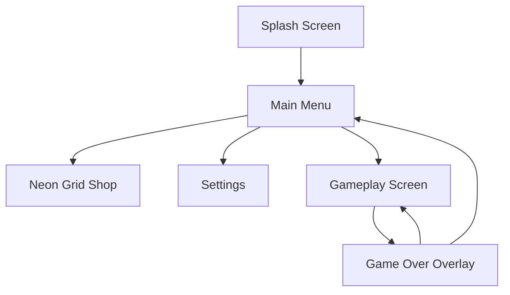

# GAME DESIGN DOCUMENT: NEON TETHER

**Project Title:** Neon Tether  
**Platform:** Mobile (Android & iOS)  
**Genre:** Rhythm-Arcade / Physics Runner  
**Target Audience:** Casual reflex gamers, rhythm game fans (13-35 years old)  
**Monetization:** Ethics-first (Rewarded ads, cosmetic items, ad-free unlock)  
**Version:** 1.0.0  

---

## 1. Executive Summary & Concept
**Neon Tether** is a fast-paced, high-juice, portrait-oriented mobile game. The player controls a binary energy system consisting of two glowing spheres linked by an elastic plasma line (the "Tether") descending down an endless vertical digital pipeline.

```
       [ Wall ]                         [ Wall ]
          |                                |
          |        (Sphere)===Tether===(Sphere)  <-- Split (Hold Screen)
          |                                |
          |          (Sphere)(Sphere)            <-- Merged (Release Screen)
          |                                |
```

---

## 2. Gameplay & Core Loops

### 2.1 Core Loop (30-second loop)
The player enters the pipeline. The tether descends automatically, gathering speed. Obstacles appear.
* **Avoidance:** Hold screen to split spheres wide to avoid center pillars. Release to merge to avoid side spikes.
* **Collection:** Grab **Volt Crystals** along the tracks.
* **Combo:** Passing close to obstacles without hitting them triggers a "Grazed" combo.
* **Fail State:** If either sphere collides with an obstacle, the tether shatters. Game over.

```
+--------------------+
|  Start Run (Tap)   |
+---------+----------+
          |
          v
+---------+----------+      Obstacles     +--------------------+
|  Descend Pipeline  +------------------->|  Hold: Split Wide  |
+---------+----------+                    +---------+----------+
          ^                                         | Release: Snap
          |                                         v
          |   Collect Coins & Combos      +--------------------+
          +-------------------------------+  Merge in Center   |
                                          +--------------------+
```

### 2.2 Secondary Loop (Retention & Progression)
* **Volt Crystals:** Used to purchase skins, custom trails, sound packs, and visual themes in the **Neon Grid Shop**.
* **Missions:** Complete 3 dynamic objectives daily (e.g., "Graze 15 pillars in a single run", "Perform 5 snap-backs under 0.2s").
* **Achievements:** Global milestones that reward player badges and unique tethers.

---

## 3. Controls & Physics Mechanics

### 3.1 Controls
* **Input:** Single-touch anywhere on the screen.
* **Action:**
  * `TOUCH_DOWN`: Spheres split outwards toward the boundary walls. The transition speed is modeled with an elastic spring easing function.
  * `TOUCH_UP`: Spheres snap back to the center line. Tension increases the speed of the merge.

### 3.2 Physics Architecture
* **Symmetry:** Both spheres maintain equal distance from the central axis.
* **Collision Detection:** Sphere-to-box collision check against obstacles. The tether line itself does not collide with solid objects (only energy fields).
* **Speed Scaling:** Descent speed starts at $S_0 = 500\text{ units/sec}$ and increments by $10\text{ units/sec}$ every $100\text{ units}$ traversed, capping at $1200\text{ units/sec}$.

---

## 4. Obstacle Design

To keep gameplay dynamic, levels are constructed from a library of rhythmic obstacles:

| Obstacle Type | Visual Design | Required Action |
| :--- | :--- | :--- |
| **Central Pillar** | Glowing block in the center track | **Split:** Hold to hug the walls. |
| **Side Pillars** | Twin blocks blocking the sides | **Merge:** Release to fit through center. |
| **Alternating Gates** | Left, then right, then center gates | **Rhythmic Tapping:** Split/Merge switches. |
| **Rotator Beam** | Rotating line obstacle | **Timing:** Split/Merge to slip past the gap. |
| **Laser Gate** | Vertical laser that shoots intermittently | **Synchronized Timing:** Move on beat. |

---

## 5. UI/UX Screen Map

The game is designed with a portrait interface for seamless one-handed accessibility.



### Screen Details:
1. **HUD (In-Game):**
   * Top Center: Current Score (Distance in meters).
   * Top Left: Combo Multiplier (e.g., x1.5).
   * Top Right: Volt Crystals collected.
   * Visual feedback: The score pulses on the beat of the music.
2. **Main Menu:**
   * High-contrast glowing titles.
   * Play Button (Massive central pulsing orb).
   * Navigation tabs: Shop, Settings, Stats, Achievements.
3. **Settings:**
   * Music & SFX volumes.
   * Haptic feedback toggle (Vibration intensity).
   * Colorblind filters (High-contrast red/blue/green shapes).

---

## 6. Visual & Audio Direction ("Juice")

### 6.1 Visuals:
* **Theme:** Retrofuturistic Synthwave / Cyberpunk Cyber-Grid.
* **Color Palette:** Dark Obsidian backgrounds (#0F0F1A) contrasted with vibrant Neon Magenta (#FF007F), Cyan (#00F0FF), and Lime (#39FF14).
* **VFX:**
  * Core particles emit trails reflecting speed.
  * Splitting causes the camera to shift back slightly (wide view).
  * Snapping together sparks neon particles when the spheres collide in the center.

### 6.2 Audio:
* **Soundtrack:** Synthwave beat at 120-140 BPM.
* **Synthesized SFX:**
  * *Split:* High-pass sweep sound.
  * *Merge Snap:* Synthesized punchy kick/snare chord.
  * *Graze:* High-pitched electronic chime.

---

## 7. Economy & Ethics-First Monetization

We reject abusive practices.
* **Hard Currency:** None. All cosmetics are purchased using **Volt Crystals** earned by playing.
* **Ad Integration:**
  * NO forced ads.
  * **Rewarded Ad:** Watch an ad at the game over screen to continue once per run (maintaining current score).
  * **Ad-Free IAP ($2.99):** Removes rewarded ad requirements. Continues become free once per game.
* **Cosmetics Shop:** 15 custom skins (Tethers, spheres) available. 10 unlockable with crystals, 5 via premium direct IAPs ($0.99 each).

---

## 8. Technical Architecture

* **Engine:** To be decided in Phase 7 (evaluating Godot vs Flutter/Flame vs Phaser).
* **Pattern:** Model-View-Controller (MVC) with a state machine governing game states:
  * `STATE_MENU`
  * `STATE_PLAYING`
  * `STATE_PAUSED`
  * `STATE_GAMEOVER`
* **Local Save System:** Local storage encrypted using AES-256 for scores and unlocks, synced to Google Play Games / Apple Game Center.
